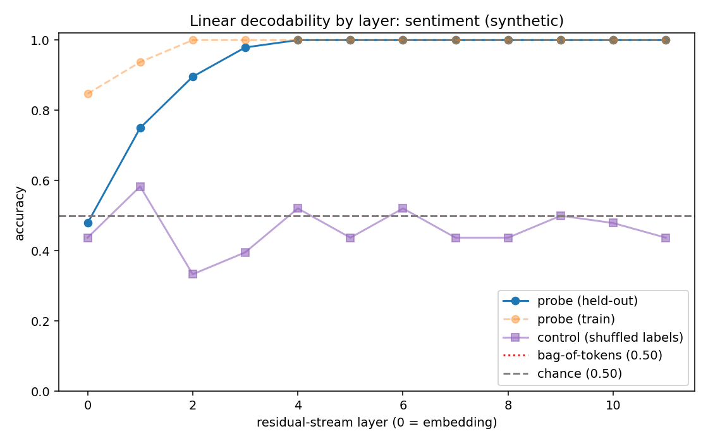
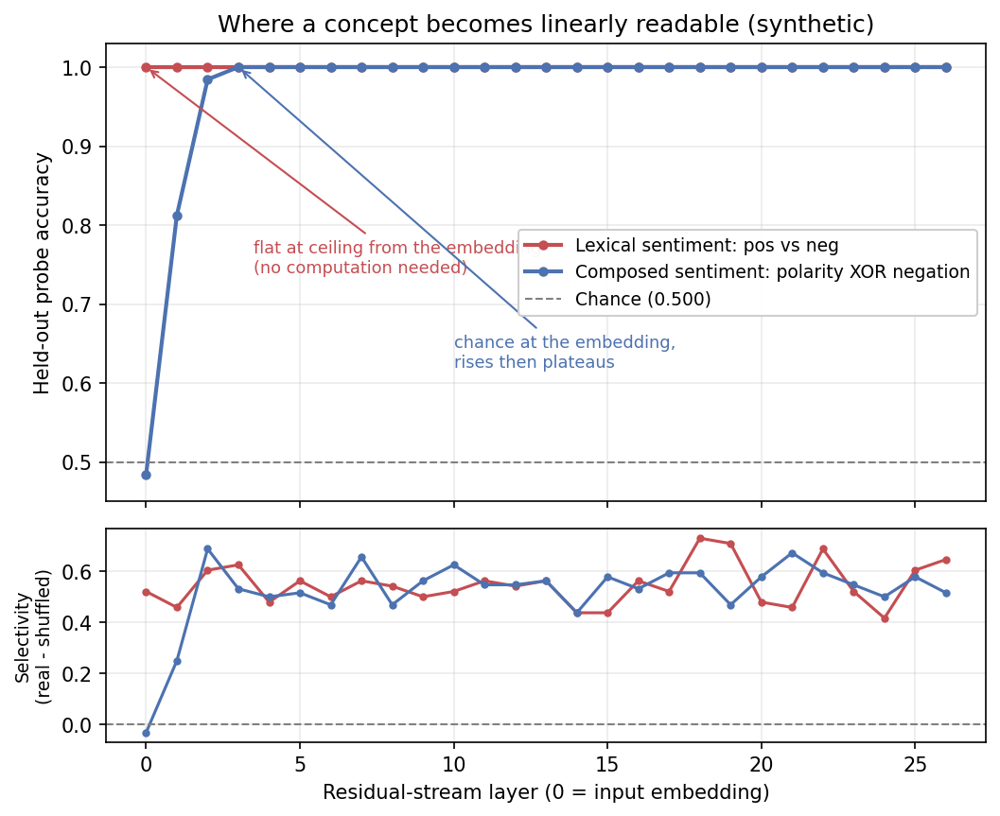

# H001: Is a concept a linearly decodable direction, and *where*?

A runnable demonstration of **linear probing** of a language model's residual
stream. We ask whether a simple concept (sentiment) is a linear direction in the
model's internal representation, and if so, at what depth it becomes readable.

## TL;DR

- Train a logistic-regression **probe** on the residual-stream activations at each
  layer of a small transformer, and plot accuracy as a function of depth.
- Guard the claim with two controls: a **shuffled-label control task**
  (selectivity = real accuracy minus control accuracy) and a **bag-of-tokens
  baseline** (does the *representation* beat the raw *words*?).
- The **shape** of the curve is the result, not any single number.

## Run it

```bash
pip install -e ".[dev]"          # from the repo root
python samples/h001_linear_probe/demo.py          # synthetic, instant, no GPU
python samples/h001_linear_probe/demo.py --real   # real Gemma 3 1B (GPU + gated)
```

Or open `notebook.ipynb` for the narrated version.

Synthetic mode plants a concept that **strengthens with depth** (weak at the
embedding layer, clear by the middle), so you see what a genuinely *computed*
concept looks like: accuracy rises with depth while the control stays near
chance. No model or download required.

## How to read the figure



- **probe (held-out)**: probe accuracy on unseen test prompts at each layer.
- **control (shuffled labels)**: a same-capacity probe trained on permuted labels.
  It should sit near chance; the gap up to the real probe is the **selectivity**.
- **bag-of-tokens**: logistic regression on raw token counts. The probe must beat
  this to show the concept lives in the *representation*, not just the words.
- **chance**: majority-class accuracy, the real floor.

A concept the model **computes** should be hard to read at layer 0 (the raw
embedding) and become readable with depth: a rise-then-plateau curve.

## The honest result (real Gemma 3 1B run)

When we run `--real` on Gemma 3 1B, held-out accuracy is near-perfect at **every**
layer, **including layer 0 (the embedding, before any transformer computation).**
That is a cautionary result, and it is the point of including it:

- The concept is **linearly present**, but the signal is **lexical /
  embedding-space**. Polar adjectives are separable in embedding space before the
  model computes anything.
- A vocabulary-disjoint split (test words never seen in training) blocks
  *memorising exact words*, but does **not** block *embedding-space leakage* of
  sentiment.
- So the apparatus works and the concept is linearly decodable, but this setup
  does **not** tell us *where the model computes* sentiment. The predicted
  rise-with-depth profile does not appear.

The fix (a follow-up demo) is to make the concept one that **cannot** be read off
the embedding, e.g. a relation that depends on composing several tokens, so depth
has to do real work. That follow-up ships here as `contrast_demo.py`.

## The follow-up: a concept the embedding cannot give you

`contrast_demo.py` runs the **same** probe pipeline on **two** concepts and
overlays their curves, because the teaching point is the *shape* contrast:

- **Lexical sentiment** (positive vs negative adjectives): separable at the
  ceiling from layer 0. The probe reads the dictionary.
- **Negation-composed sentiment** (`net = adjective_polarity XOR negation`):
  "wonderful" and "not wonderful" share an adjective but carry opposite labels, so
  the adjective alone is uninformative. A bag-of-tokens baseline sits at chance for
  two independent reasons: it cannot represent XOR at all, and the vocab-disjoint
  split (vectoriser fit on train only) leaves held-out adjectives out of its
  feature space entirely. The model has to **compose** the two, and the probe curve
  shows it: chance at the embedding, rising to a ceiling across the early-to-mid
  stack.

```bash
python samples/h001_linear_probe/contrast_demo.py          # synthetic, instant
python samples/h001_linear_probe/contrast_demo.py --real   # real Gemma 3 1B
```



On a real Gemma 3 1B run (`--real`, seed 0, mean-pooled residual), the lexical
curve is flat at 1.000 from layer 0, while the composed curve is **0.500 (chance)
at the embedding** and climbs to **1.000 by layer 8**, with the bag-of-tokens
baseline at 0.500 for both. Same model, same probe, same ceiling at the top,
opposite meaning. The bottom panel (selectivity, real minus shuffled-label
control) confirms the composed rise is representation, not probe capacity.

**What it does and does not show (read this).** A rising curve locates where the
composed concept becomes *linearly readable*, which is a real and useful claim. It
is **not** a localisation of *which heads or MLPs build it* (that is causal
activation patching, not a probe), and "readable by layer 8" is the ceiling of
this particular mean-pool readout, not a claim that the information lives only
there. Accuracy can also plateau while the probe *direction* keeps rotating across
depth, so the plateau is not evidence the representation has "settled." Fuller
research notes are available on request.

## Files

```
h001_linear_probe/
  demo.py          single-concept sweep (synthetic by default, --real for Gemma)
  contrast_demo.py two-concept depth-profile contrast (lexical vs composed XOR)
  notebook.ipynb   narrated walkthrough
  figures/         figures + report JSON the demos write
  README.md        this file
```

The reusable machinery (`SentimentDataset`, `NegationSentimentDataset`,
`ActivationCapturer`, `LinearProbe`, `LayerProbeSweep`, `LayerCurvePlotter`,
`DepthProfileContrastPlotter`) lives in the shared package
`src/mechinterp_samples/` so later demos reuse it. See the top-level README for
the design.
