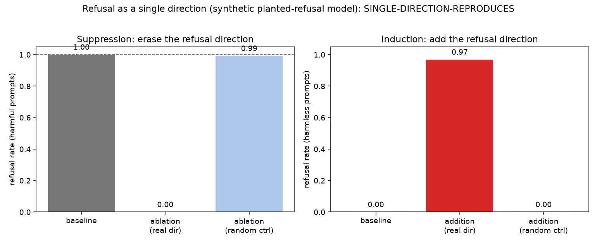

# H005: Is refusal mediated by a single direction?

A runnable reproduction of **Arditi et al. 2024**, "Refusal in Language Models Is
Mediated by a Single Direction" (arXiv:2406.11717, NeurIPS 2024). The question:
in a safety-tuned chat model, is refusal of harmful instructions carried by *one*
direction in the residual stream, such that erasing it stops refusal and adding
it creates refusal?

## TL;DR

- Build a **refusal direction** as a difference of means: the average activation
  on harmful instructions minus the average on harmless ones.
- Test it two ways. **Suppression:** project the direction out of the residual
  stream (directional ablation) on held-out *harmful* prompts; does refusal drop?
  **Induction:** add the direction on held-out *harmless* prompts; does refusal
  appear?
- Guard the claim with a **norm-matched random control**. Even a random vector of
  the same size moves a model's behaviour, so the result is not "I ablated my
  direction and refusal fell"; it is "the real direction moves refusal and an
  equal-norm random direction does not." That gap is the experiment.

## Run it

```bash
pip install -e ".[dev]"          # from the repo root
python samples/h005_refusal_direction/demo.py          # synthetic, instant, no GPU
python samples/h005_refusal_direction/demo.py --real   # discover a direction on a real model
```

Synthetic mode uses a **planted-refusal model**: a stand-in whose refusal is, by
construction, one known direction. The demo recovers that direction with a
difference of means and shows the full two-arm result with no model, no download,
and no harmful content. It is the same discipline the analysis code is built on:
prove the pipeline on a model whose ground truth you control before spending GPU
time on a real one.

## How to read the figure



Two panels, each a refusal rate (fraction of completions that begin with a
refusal phrase):

- **Suppression (left), on harmful prompts.** `baseline` is how often the model
  refuses normally. `ablation (real dir)` is refusal after erasing the
  difference-of-means direction; it should fall hard. `ablation (random ctrl)` is
  refusal after erasing a norm-matched random direction; it should stay near
  baseline. The gap between the two ablation bars is the claim.
- **Induction (right), on harmless prompts.** `baseline` is near zero. `addition
  (real dir)` is refusal after adding the direction; it should rise hard.
  `addition (random ctrl)` should stay near zero.

A single-direction result is one where the **real** bars move and the **random
control** bars do not, in both panels.

## What a real run shows

On a real safety-tuned chat model that refuses at baseline, this reproduces: one
difference-of-means direction both suppresses refusal under ablation and induces
it under addition, each well beyond the norm-matched random control. The verdict
the pre-registered rule returns in that case is `SINGLE-DIRECTION-REPRODUCES`.

Two honest caveats this sample builds in:

- **The model has to refuse in the first place.** The pre-registered rule returns
  `NO-BASELINE-REFUSAL` when a model refuses too few harmful prompts at baseline
  to measure a suppression effect. That is a real outcome, not a failure: you
  cannot watch a switch turn off in a model that was barely refusing. The right
  response is to record it and pick a model that exhibits the behaviour, not to
  lower the bar.
- **A sufficient knob is not a single representation.** A positive says one
  direction is *enough* to flip the behaviour (causal sufficiency). It does not
  say refusal is *stored* on one axis. Recent work finds refusal decomposes into
  many geometrically distinct directions that nonetheless act as a shared
  one-dimensional control knob (Joad et al. 2026), and that ablating *several*
  directions suppresses more thoroughly than one (Piras et al. 2026). So "one
  direction works" is a floor, not a ceiling.

## Why this is a safety result, not a recipe

The point is the fragility. A load-bearing safety behaviour turns out to ride on
a low-dimensional, editable feature you can find with a difference of means. That
is worth knowing whether you want to defend the behaviour or understand it.

This sample is scoped to keep the interpretability lesson without shipping a
turnkey refusal-removal tool:

- The default is **synthetic** (a planted model; no real weights, no harmful
  content).
- The `--real` path only **discovers** the direction from instruction activations
  and reports where harmful and harmless instructions separate. It does **not**
  generate text under ablation. The full generate-under-ablation reproduction,
  and its reviewed harmful/harmless data step, live in the private research repo.
- The only thing the demo writes is refusal **rates** and the figure.

## Files

```
h005_refusal_direction/
  demo.py          single-direction reproduction (synthetic by default, --real to discover on a model)
  figures/         the figure + report JSON the demo writes
  README.md        this file
```

The reusable machinery (`RefusalDirection`, `DirectionalAblation`,
`ActivationAddition`, `RefusalClassifier`, `PlantedRefusalModel`,
`SingleDirectionExperiment`, `RefusalReproductionPlotter`) lives in the shared
package `src/mechinterp_samples/` so later demos reuse it. See the top-level
README for the design. Fuller research notes are available on request.
